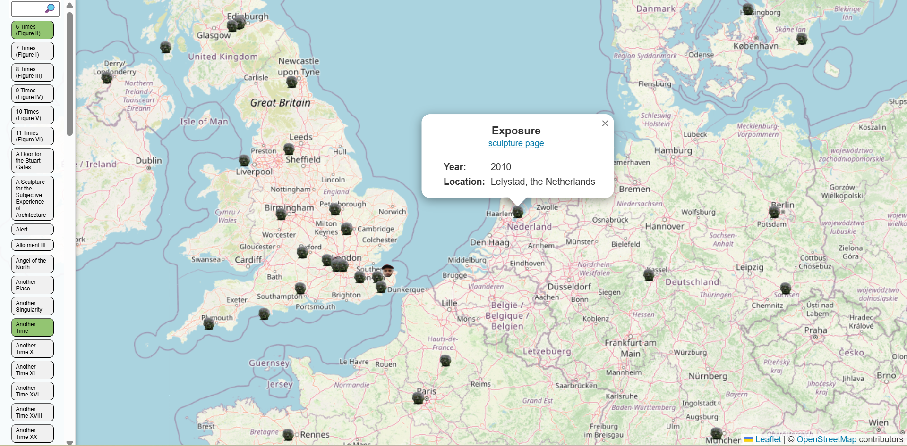

# Readme
A test of how well munrosWithFriends is designed by pivoting the code for generic map icon building. In this case, a view of "bagged" Antony Gormley sculptures.

Pleased with how straightforward this was. Any map view basically just needs adjustments in data.csv and in the jinja template. Might get round to removing all template hard coding.

Sculpture data is largely taken from the official website [map](https://www.antonygormley.com/works/sculpture/permanent/map), however this seems to miss some and I split out multiple scultpures belonging to the same work.

